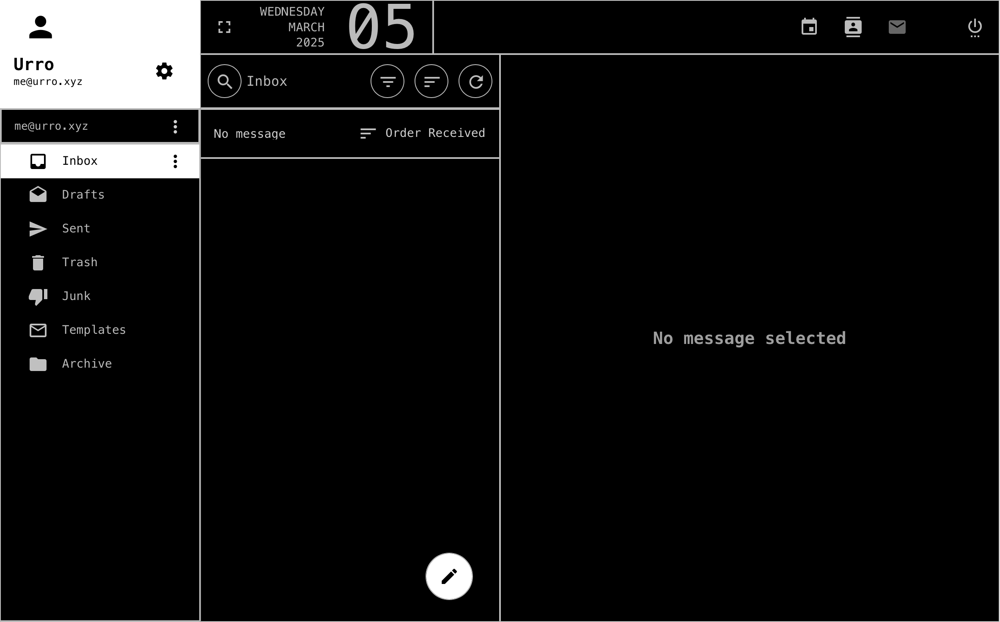

# SOGo Brutalist
Brutalist theme for [SOGo](https://github.com/Alinto/sogo) webmail client used in [Mailcow: Dockerized](https://github.com/mailcow/mailcow-dockerized).

## Examples
### Inbox


## Installation
### Step 1
Download the theme to `/opt/mailcow-dockerized/data/conf/sogo/`:
``` bash
cd /opt/mailcow-dockerized/data/conf/sogo/
wget https://raw.githubusercontent.com/urroxyz/sogo-brutalist/refs/heads/main/dark/custom-theme.css
```

### Step 2
Create and populate `/opt/mailcow-dockerized/docker-compose.override.yml`:
```bash
sudo nano /opt/mailcow-dockerized/docker-compose.override.yml
```
<p align="center">with the content</p>

```yml
version: '2.1'

services:
  sogo-mailcow:
    volumes:
      - ./data/conf/sogo/custom-theme.css:/usr/lib/GNUstep/SOGo/WebServerResources/css/theme-default.css:z
```

### Step 3
Use `docker compose` or `docker-compose` to `down` and/or `up` the containers:
```bash
cd /opt/mailcow-dockerized/ && (sudo docker-compose up -d || sudo docker compose up -d)
```
<p align="center">or, if nothing happens,</p>

```bash
sudo reboot
```

Restart your browser and clear the cache.

## Configuration
Please create a pull request if you have any suggestions and I will commit it.

If you would rather that I make the changes, create an issue and let me know your suggestions and for which element (via tag, `class` or `id`).
